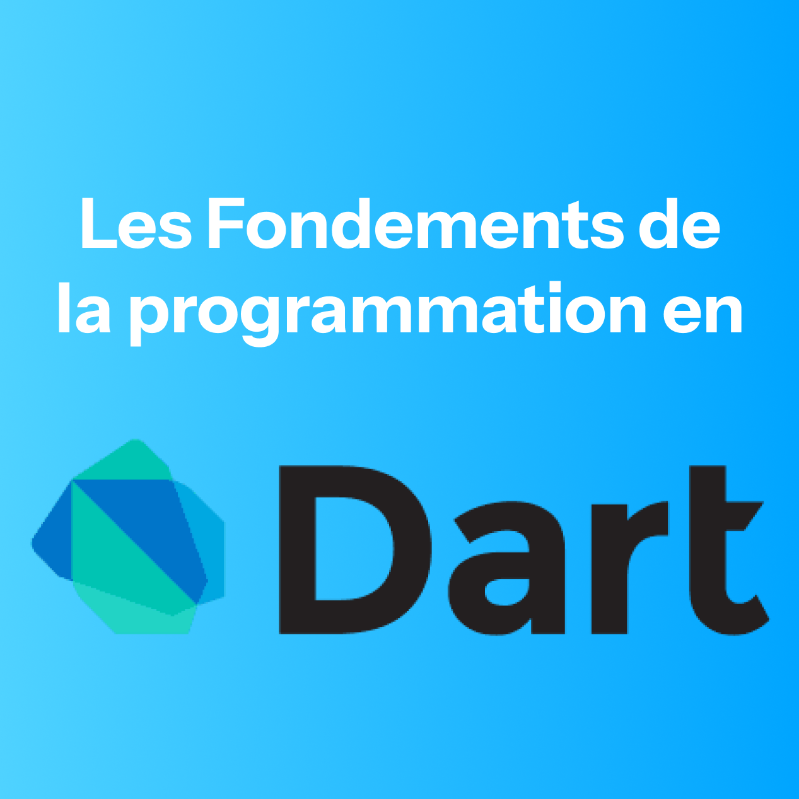

## Histoire du language dart
> Dévoiller le 11 octobre 2011 lors de la conférence GOTO à Aarhus, au Danemark, le projet a été fondé par Lars Bak et Kasper Lund. Sa première version est sortie le 14 novembre 2013. 
> Initialement concue pour remplacer le javascript elle fut à partir de la version 1.9 en 2015 adapter pour ce concentrer sur la compilation vers le Javascript.  À partir de 2018 le language dart fue améliorer pour accompagner le framework flutter grace à l'outils dart2native.  Dans ce cours nous nous interesseront aux notions de base pour apprendre le language dart.

## **Somaires**
### 1. **[Installation](1.%20Installation/README.md)**
### 2. **Les commentaires**

 <ul style="list-style-type: lower-alpha; border-left: 5px solid rgba(255, 255, 255, 0.2); display: block; background-color: rgba(255, 255, 255, 0.06); border-radius: 2px 1px;">
    <li>uniligne <code>//</code></li>
    <li>mutiligne <code>/* */</code></li>
    <li>Documentation uniligne <code>///</code></li>
    <li>Documentation multiligne <code>/* ** */</code></li>
</ul>

### 3. **Les variables**

 <ul style="list-style-type: lower-alpha; border-left: 5px solid rgba(255, 255, 255, 0.2); display: block; background-color: rgba(255, 255, 255, 0.06); border-radius: 2px 1px;">
    <li>Le mot clé( <code>var</code> )</li>
    <li>Typée( <code>String, int, double, etc...</code> )</li>
    <li>Les constantes( <code>final</code>, <code>const</code> )</li>
    <li>Le Type Dynamique( <code>dynamic</code> ) </li>
    <li>Les Assignations retarder( <code>late</code> )</li>

</ul>

### 4. **Les opérateurs**

 <ul style="list-style-type: lower-alpha; border-left: 5px solid rgba(255, 255, 255, 0.2); display: block; background-color: rgba(255, 255, 255, 0.06); border-radius: 2px 1px;">
    <li>
        Arithmétiques( <code>+</code>, <code>-</code>, <code>*</code>, <code>/</code>, <code>~/</code>, <code>%</code> )
    </li>
    <li>
        Relationnels( <code>==</code>, <code><</code>, <code>></code>, <code><=</code>, <code>>=</code>, <code>!=</code> )
    </li>
    <li>
        Test types( <code>is</code>, <code>is!</code>, <code>as</code> )
    </li>
    <li>
        Bit à Bit( <code>&</code>, <code>|</code>, <code><<</code>, <code>>></code>, <code>^</code> ) 
        </li>
    <li>
        Assignations( 
            <code>=</code>, <code>+=</code>, <code>-=</code>, <code>*=</code>, <code>/=</code>, <code>~/</code>, <code>%</code>, <code>??=</code> )
    </li>
    <li>
        Logical( <code>&&</code>, 
        <code>||</code>, 
        <code>!</code>, 
        <code>??</code> )
    </li>
    <li>Null Safety( <code>?</code>, <code>!</code> )</li>
    <li>Cascade( <code>..</code> )</li>

</ul>

### 5. **Les entrées et sorties standard**

 <ul style="list-style-type: lower-alpha; border-left: 5px solid rgba(255, 255, 255, 0.2); display: block; background-color: rgba(255, 255, 255, 0.06); border-radius: 2px 1px;">
    <li>
    Les entrées
        <ul>
            <li><code language="dart">stdin.readLineSync()</code></li>
            <li><code language="dart">stdin.readByte()</code></li>
        </ul>
    </li>
    <li>
    Les sorties
        <ul>
            <li><code language="dart">print()</code></li>
            <li><code language="dart">stdout.write()</code></li>
        </ul>
    </li>
</ul>

### 6. **Les types**

 <ul style="list-style-type: lower-alpha; border-left: 5px solid rgba(255, 255, 255, 0.2); display: block; background-color: rgba(255, 255, 255, 0.06); border-radius: 2px 1px;">
    <li>Les nombres( <code language="dart">num</code>, <code language="dart">int</code>, <code language="dart">double</code> )</li>
    <li>Les chaines de caractères( <code language="dart">String</code> )</li>
    <li>Les Lists ( <code language="dart">List</code> )</li>
    <li>Les Sets ( <code language="dart">Set</code> )</li>
    <li>Les Maps ( <code language="dart">Map</code> )</li>
    <li>Les Runes ( <code language="dart">Runes</code> )</li>
    <li>Les Symbols ( <code language="dart">Symbol</code> )</li>
    <li>Le Null ( <code language="dart">Null</code> )</li>
</ul>

### 7.  Les fonctions 

 <ul style="list-style-type: lower-alpha; border-left: 5px solid rgba(255, 255, 255, 0.2); display: block; background-color: rgba(255, 255, 255, 0.06); border-radius: 2px 1px;">
    <li>Déclaration</li>
    <li>
        Les Paramètres
        <ul>
            <li>Optinnels</li>
            <li>Nommés</li>
            <li>Avec valeur par défaut</li>
        </ul>
    </li>
    <li>Fonction récusive</li>
    <li>Lambda expression</li>
    <li>Les Types de Fonction</li>
    <li>Les Fonctions anonymes</li>
    <li>Sortir lors de l'exécution du code</li>
    <li>Les fonctions asynchrone ( <code language="dart">await</code>, <code language="dart">async</code>, <code language="dart">Future</code> )
</ul>

### 8. Les classes

 <ul style="list-style-type: lower-alpha; border-left: 5px solid rgba(255, 255, 255, 0.2); display: block; background-color: rgba(255, 255, 255, 0.06); border-radius: 2px 1px;">
    <li>Déclaration( <code>class</code> )</li>
    <li>Les Attributs</li>
    <li>Les Méthodes</li>
    <li>Les Constructeurs
        <ul>
            <li>Par défaut</li>
            <li>Personnaliser</li>
            <li>Multiples</li>
            <li>Le mot clé <code>super</code></li>
        </ul>
    </li>
    <li>Le mot clé <code>this</code></li>
    <li>Le mot clé <code>static</code></li>
    <li> L'héritage 
        <ul>
            <li>Avec <code>extends</code></li>
            <li>Les Mixin <code>mixin</code></li>
        </ul>
    </li>
    <li>Le Overriding <code>@override</code></li>
    <li> Les accesseurs 
        <ul>
            <li>Getters <code>get</code></li>
            <li>Setters <code>set</code></li>
        </ul>
    </li>
    <li>Les classes abstraite <code language="java">astract</code></li>
    <li>Les classes comme des fonctions <code language="java">call</code></li>
    <li>Les interfaces</li>
    <li>Déclaration</li>
</ul>

### 9. Les exceptions

 <ul style="list-style-type: lower-alpha; border-left: 5px solid rgba(255, 255, 255, 0.2); display: block; background-color: rgba(255, 255, 255, 0.06); border-radius: 2px 1px;">
    <li>Le Block try-catch ( <code language="dart">try</code>, <code language="dart">catch</code> )</li>
    <li>On ( <code language="dart">On</code> )</li>
    <li>Les Exceptions Personnaliser</li>
</ul>

### 10. Les assertions

---

Ressource : 
> - [Introduction au language dart](https://www.geeksforgeeks.org/dart/introduction-to-dart-programming-language/)